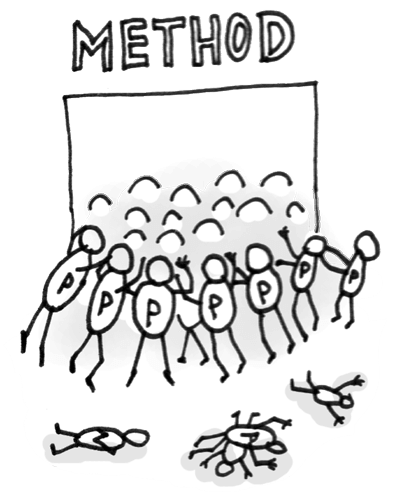

## 原文
https://sourcemaking.com/refactoring/smells/long-parameter-list

## 迹象和症状
一个方法有多于3个或者4个的参数    

## 问题原因
* 当几种算法被放在一个方法里面的时候，可能会出现一大串的参数。这些参数用于控制哪种算法应该执行，每种算法可能都需要各自的参数。
* 长参数列表可能是为了使类之间更加独立而造成的副产品。