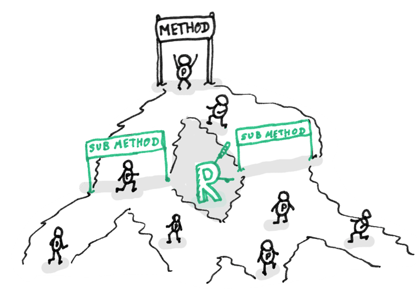

## 原文
https://sourcemaking.com/refactoring/smells/long-parameter-list

## 迹象和症状
一个方法有多于3个或者4个的参数    

## 问题原因
* 当几种算法被放在一个方法里面的时候，可能会出现一大串的参数。这些参数用于控制哪种算法应该执行，每种算法可能都需要各自的参数。
* 长参数列表可能是为了使类之间更加独立而造成的副产品。例如，那些用于创建 方法中所需的特定对象 的代码已经从该方法移至用于调用该方法的地方，并且创建的对象以参数的形式传递给该方法。因此，原始类不再需要了解对象是怎么创建的，并且依赖性降低了。但是，如果我们需要创建几个类似的对象，每个对象都需要自己的参数，那么我们就会有一个很长的参数列表。
* 如果一些列表随着时间而增长并且难以使用，那么程序员是很难理解这样的列表的。一个方法可以使用自己的对象（包含所需的字段）来作为参数，而不是一长串参数。如果当前的对象不能包含所有数据，可以将另外一个对象（它可以获取到必须的数据）作为参数传递

## 治疗方法
我们需要检查方法（A）的参数列表。如果一些参数只是另外一个对象的方法（B）的调用结果，那么我们可以将**参数替换为方法调用**。 我们可以将方法（B）调用放进方法（A）中，或者将方法作为参数传递

* 我们可以将整个对象作为参数传递进去，而不是将其中的一个个字段分别传入方法
* 如果几个参数之间确实没有联系，我们可以将他们合并进一个参数对象

## 结果
* 更具有可读性，更简洁的代码
* 重构的时候可能发现之前没有发现的重复代码