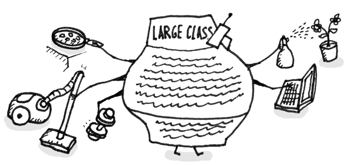
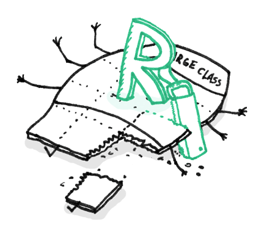
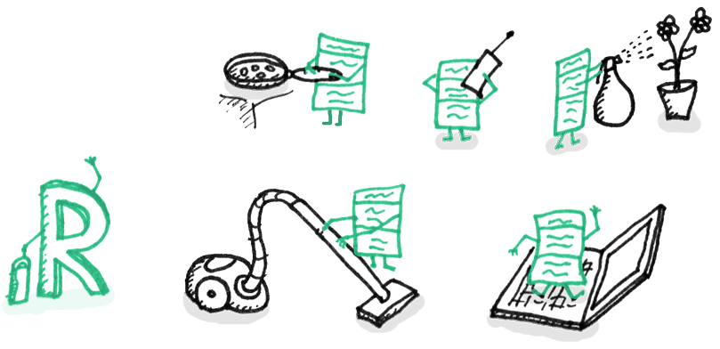

## 迹象和症状
一个类里面包含了许多 字段/方法/代码行

## 问题原因
类通常一开始都很小。但是随着时间的流逝，随着程序的增长，他们变得越来越臃肿。
和长方法类似，程序员通常发现将一个新的功能直接放进一个现有的类比创建一个新类型更加方便快捷，而且不用过多的思考。

## 治疗方法
当一个类头上带了太多的帽子（拥有太多的功能），可以考虑拆分类。

* 如果一个大类的部分行为拆分出去，**提取类**会很有帮助
* 如果一个大类的一部分行为可以用不同的方式实现，或者不经常使用，可以用**提取子类** 的方式拆分
* 如果有必要列出客户端可以使用的操作和行为的列表，则**提取接口**提供帮助
* 如果大类负责的是图像界面，我们可以将一些数据和行为拆分到一个独立的领域对象。这样做可能需要将某些数据在两个地方保存并且数据一致性。 **重复观测数据**可以提供帮忙。

## 结果
* 这些类的重构使得程序员无需记住类的各种属性和功能
* 在许多情况下，大类的拆分可以避免代码和功能的重复。

