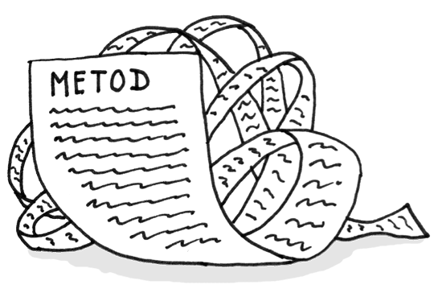

## 迹象和症状
一个方法包含了太多行代码。通常来说，对于任何长于10行的方法，我们都应该问问自己是否能优化它。   

## 问题原因
就像是自己的私房钱一样，大家总喜欢往方法里面添加一些内容，但是都不会取出任何内容。因为写代码比认真的阅读代码更容易，这种“气味”会持续到其变成丑陋且巨大的怪兽才会被注意到。

## 治疗方法
根据经验，如果你感觉你需要对一个方法内的代码添加注释，更好的方法是把代码放到一个新的方法内。 如果一行代码也需要注释，它也可以被提取成另外的方法。而且如果方法有一个描述性的名字，大家都可以不关注它是怎么实现的。
    

* **提取方法** 用于减少方法内的代码行数
* 局部变量和参数会干扰我们提取方法，这个时候我们可以使用 **用查询代替临时变量**，**引入参数对象** 或者 **保留整个对象**
* 如果上述方法都没法帮到你，可以将整个方法放到一个独立的对象里面（**用方法对象替换方法**）
* 条件运算符和循环是可以将代码移动到要给独立方法的好线索。对于条件判断，我们可以使用 **分解条件**。对于循环，我们可以直接使用 **提取方法**

## 结果
* 在所有的面向对象类型的代码中，带有短方法的类是最好维护的。方法或者函数越长，就越难以理解和维护。
* 另外，长方法给不必要的重复代码提供了完美的隐藏空间

## 性能
许多人对于方法数量的增加会损害性能有所疑惑。 在绝大多数情况下，其对性能的影响微乎其微，甚至都不值得担心。
另外，现在你拥有清晰易懂的代码，那么在真正需要的时候，你可以更好的进行重构来提高性能。这才是正确的做法。