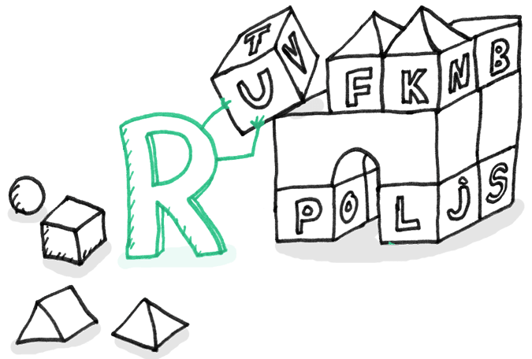

## 原文
https://sourcemaking.com/refactoring/smells/primitive-obsession

## 迹象和症状
* 对于一些简单的任务，使用基础类型而不是小型object（例如货币，范围，电话号码等特殊字符串，等等）
* 使用常量来代表一些编码信息（例如 使用 USER_ADMIN_ROLE = 1来代表拥有管理员权限的用户）
* 在数组中，将字符串常量当成字段名使用

## 问题原因
就像其他的代码气味一样，对于基础类型的痴迷也是诞生于想要简单快速的完成任务。程序员会说：“就是个用于存储数据的字段而已” 。创建一个基础类型比创建一个新的类方便多了，不是么？然后代码就写下去了。然后需要另一个字段，那也是这样创建好了。你瞧，类变得庞大而笨拙。

基础类型通常用于“模拟”类型（例如用Const string模拟Enum）。因此你没有使用单独的数据类型，而是使用一串数字或者字符串来组成可能的值列表。通过常量给这些特殊的数字和字符串一个容易理解的名字，这就是为什么他们传播的如此广泛久远。

另一个使用不当的例子是字段模仿，这个类包含了各种各样的数据和字符串常量（这些在这个类里都是被指定的）被用来作为数组索引去获取数据。

## 治疗方法
如果你有一些类有很多基础字段，我们可以根据逻辑（功能）分组，并且归类提取到各自的类中。更好的做法是将把和这些字段相关联的行为也移入这个类。对于这个任务，请尝试**用对象替换数据值**

* 如果在方法参数中使用了基本字段的值，请使用“**引入参数对象**”或“**保留整个对象**”
* 如果有一个类使用了Type code(例如Person类拥有四个血型字段O,A,B,AB)，使用**用类代替Type Code**，**用子类代替Type Code**，或者**用策略/声明代替Type Code**
* 如果一个列表包含了各种数据类型，使用**用对象代替列表**

## 结果
* 使用了对象而不是基础字段，使得代码更加灵活，更具有可扩展性。
* 更容易理解，而且代码的结构变得更好。对于特定数据的操作都在一个位置，而不是分散的。不用去猜测奇怪的常量是做什么的，产生的原因。
* 更不容易写重复的代码

